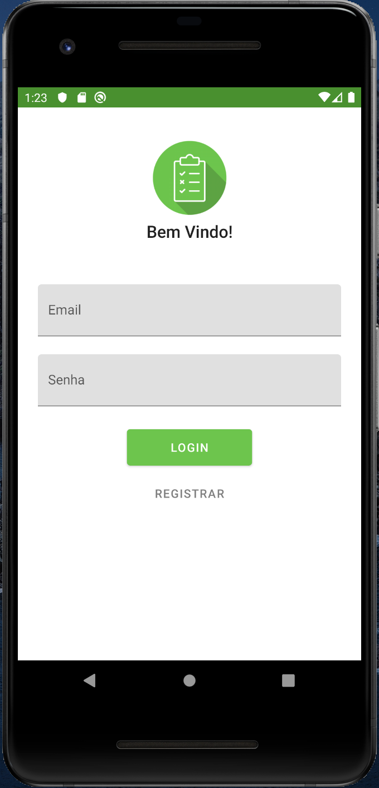
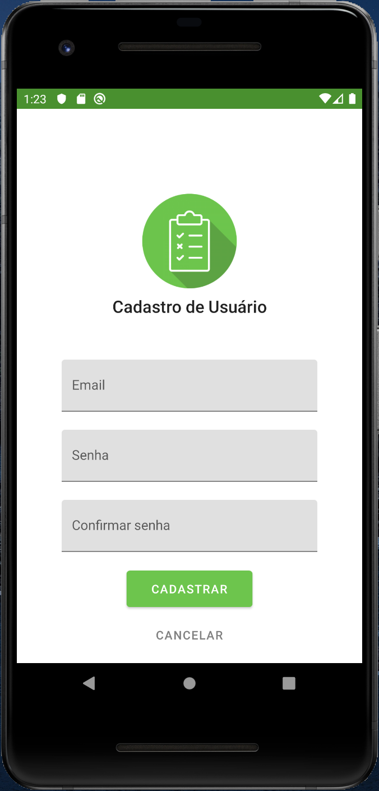
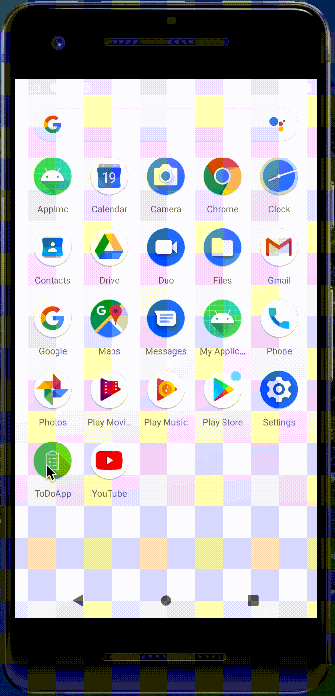

![top_language] ![repo-size] ![license]

### Projeto desenvolvido durante a disciplina Desenvolvimento para dispositivos móveis utilizando o Android Studio, que é a IDE oficial para o desenvolvimento de aplicativos Android.

## Layout e funcionalidades do aplicativo

  
  
  
  
  

## :bookmark: Sobre

O **ToDoApp** é um aplicativo de to-do list, no qual o usuário pode criar tarefas e subtarefas. Apesar de simples é uma ótima ferramenta de produtividade pessoal.

## :computer: Tecnologias

Ferramenta para o desenvolvimento:

- [Android Studio](https://developer.android.com/studio)

Linguagens:

- [Kotlin](https://kotlinlang.org/)
- [Java](https://www.java.com/pt_BR/)

## :memo: Licença

Esse projeto está sob a licença [MIT](LICENSE).

<!-- Badges -->
[top_language]: https://img.shields.io/github/languages/top/iancmilan/todoapp?style=flat-square
[repo-size]: https://img.shields.io/github/repo-size/iancmilan/todoapp?style=flat-square
[license]: https://img.shields.io/github/license/iancmilan/proffy?style=flat-square
